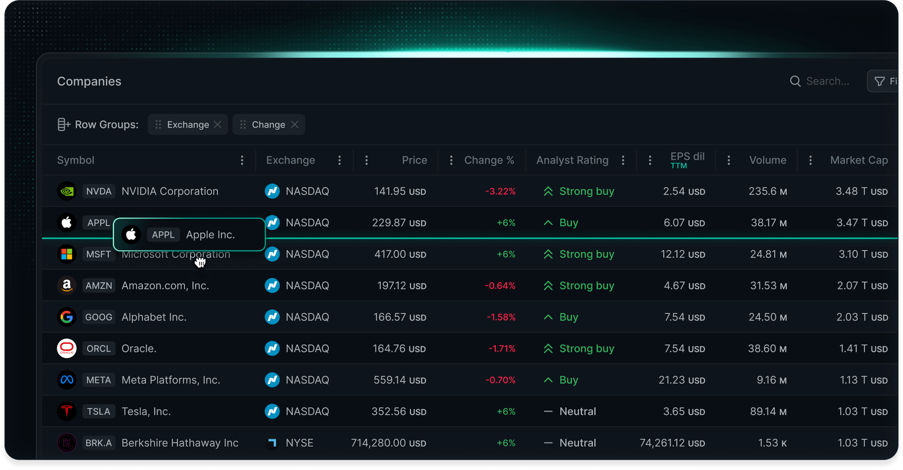

    
  <picture>
    <source media="(prefers-color-scheme: dark)" srcset="./resources/lytenyte-dark.svg"/>
    <source media="(prefers-color-scheme: light)" srcset="./resources/lytenyte-light.svg"/>
    
  </picture>
    

  <h3>The Fastest <a style="color:#139C8C;" href="https://1771technologies.com">React Data Grid</a> 
   Available on the Modern Web
   </h3>

Experience unmatched speed, memory efficiency, and a comprehensive feature set
in a remarkably small bundle size. Engineered to help enterprises achieve exceptional results.
Take complete control of your data with intuitive sorting, precise filtering, powerful
row grouping, and data aggregation capabilities. All these features come standard in our free Core edition.

Upgrade to PRO to access a wealth of advanced capabilities, including tree data structures and asynchronous data
loading—just to name a few. Take advantage of our purpose-built UI components
for column and view management. Create customized column menus, context menus,
data exports, and popover dialogs with ease. And that's only scratching the surface of what LyteNyte PRO offers.

<!--  -->

<a href="https://1771technologies.com">Website</a> &nbsp;&nbsp;—&nbsp;&nbsp; <a href="https://1771technologies.com/docs/intro-getting-started">Documentation</a> &nbsp;&nbsp;—&nbsp;&nbsp; <a href="https://1771technologies.com/demo">Demo</a> &nbsp;&nbsp;—&nbsp;&nbsp; <a href="https://1771technologies.com/pricing">Pricing</a> &nbsp;&nbsp;—&nbsp;&nbsp; <a href="https://1771technologies.com/eula">EULA</a>

---

LyteNyte Grid is available in two editions:

1. **LyteNyte Core**: A free, feature-rich edition delivering essential high-performance
   table capabilities including **row grouping**, **column autosizing**,
   and **row detail** views. Licensed under Apache 2.0.

2. **LyteNyte PRO**: A premium commercial edition that enhances Core
   functionality with enterprise-grade features such as **asynchronous data loading**,
   **column manager components**, and **data exporting** capabilities.

## Key Design Principles

- **Performance-First**: LyteNyte Grid is engineered with speed as a fundamental
  priority, ensuring responsive performance even when handling large datasets.

- **Modern Architecture**: Leveraging cutting-edge web technologies, LyteNyte
  Grid utilizes native browser scroll functionality to keep the main
  thread unencumbered as users navigate through their data.

- **React-Aligned Philosophy**: Adhering to React's core principles, LyteNyte Grid
  implements one-way data binding and declarative rendering to
  maintain predictable state management.

## Quick Start

- Begin with our comprehensive [getting started guide](https://www.1771technologies.com/docs/intro-getting-started)
- Explore our flexible [pricing options](https://www.1771technologies.com/pricing) to find the ideal fit for your project
- Follow our step-by-step [installation guide](https://www.1771technologies.com/docs/intro-installation) to seamlessly integrate LyteNyte Grid into your application

## Licensing

**LyteNyte Core** is licensed under [Apache 2.0](https://www.apache.org/licenses/LICENSE-2.0), a permissive license
that allows royalty-free commercial use with access to the foundational features that power LyteNyte Grid.

**LyteNyte Grid PRO** is available under our [Commercial License](https://www.1771technologies.com/eula), a perpetual
fallback license that unlocks the full potential of LyteNyte Grid with advanced features not available in the Core edition.

## Support

Our dedicated team is committed to the ongoing development and
maintenance of both LyteNyte Grid Core and PRO editions. For details on
support options and resources, please refer to our [support guide](https://www.1771technologies.com/support).

## Contributing

> [!IMPORTANT]
> We are not currently accepting external pull requests while we finalize our code
> architecture and development tooling. We appreciate your patience
> and interest in contributing to LyteNyte Grid.

Please review our [contributing guide](./CONTRIBUTING.md) to learn about our development
process, bug reporting procedures, and codebase maintenance practices.

## Changelog

Our detailed [changelog](https://www.1771technologies.com/docs/changelog/changelog) is regularly updated to
document enhancements and fixes in each release. LyteNyte Grid
adheres to [semantic versioning](https://semver.org/) standards for predictable release management.

## Security

For information on reporting security vulnerabilities,
please consult our [security policy](./SECURITY.md).
