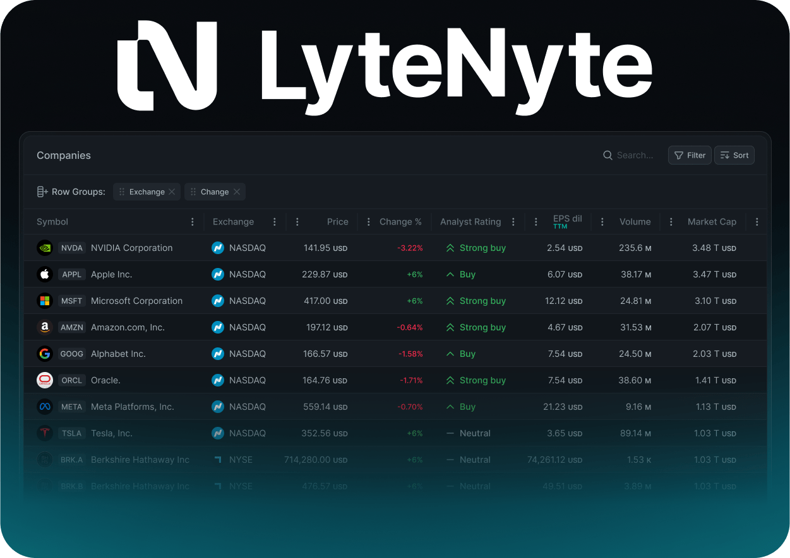

# LyteNyte Grid | Fastest React Data Grid

LyteNyte Grid is a feature rich fully extendible React Data Grid. LyteNyte Grid focuses
on delivering:

- Blazingly fast performance
- Low memory overhead
- Small bundle-size

LyteNyte Grid has zero external dependencies. It was built for React and works within the
React component lifecycle.

LyteGrid Grid has two versions:

1. LyteNyte Core: A free feature packed edition of LyteNyte Grid. Core provides the
   basic set of features of a high performance table. For example,
   **row grouping**,**column autosizing**, and **row detail**. Licensed under Apache 2.0.
2. LyteNyte Enterprise: A commercial edition of LyteNyte Grid extending the Core functionality
   with enterprise grade features and components, such as **asynchronous data loading**, **column manager components**,
   and **data exporting**.

## Key Design Principles

- Efficient: performance is a must, and considerable effort has been made to ensure the
  grid is fast and remains fast.
- Leverages modern web technologies and APIs. For example, LyteNyte Grid uses the native
  scroll functionality of Browsers ensuring the main thread is not blocked as users scroll.
- One way data binding and declarative rendering. In keeping with React's design
  principles LyteNyte Grid maintains a predicable state flow.

<strong>Table of Contents</strong>

- Features Summary
- Quick Start
  - Installation
  - Setup
  - Basic View
- License
- Template Projects
- Documentation
  - Getting Started
  - Installation
- Support
- Changelog
- Security
- Contributing

