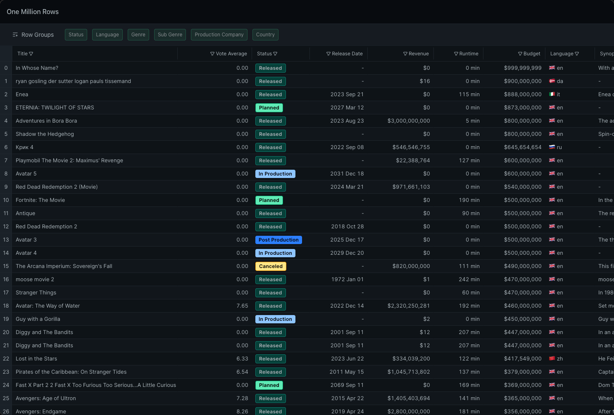
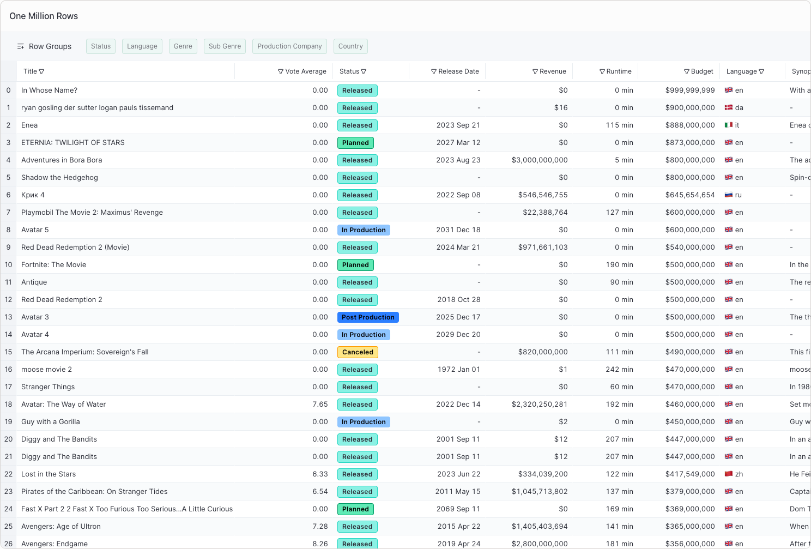

## Overview

This guide describes the server data-loading TypeScript reference implementation.
The code is on GitHub and can be [cloned here](https://github.com/1771-Technologies/one-million-row-demo).
See the [README](https://github.com/1771-Technologies/one-million-row-demo/blob/main/README.md) for setup instructions.

The reference implementation is self-contained so you can get started quickly.
It uses [SQLite](https://sqlite.org/) as the backing database. While SQLite is great
for examples and embedded use, we recommend an industrial-grade
database such as [ClickHouse](https://clickhouse.com/).

Use this implementation to understand the form of SQL queries your backend
should run to support LyteNyte Grid features. It demonstrates filtering, sorting, grouping, and aggregations.

## The `view-slice.ts` File

Aside from the UI, the key file is `view-slice.ts`. It builds and executes the SQL query for a given view.
See the [file for an in-depth review](https://github.com/1771-Technologies/one-million-row-demo/blob/main/server/view-slice.ts).
If you're not familiar with SQL, study this file to guide your own server-side data-source implementation.

## About the Data

The reference implementation uses a movie dataset with ~1.3 million rows, available on
[Kaggle](https://www.kaggle.com/datasets/shubhamchandra235/imdb-and-tmdb-movie-metadata-big-dataset-1m) for testing.
It does not use every column, and some values have been adjusted to better illustrate the example. See
[`create-db.ts`](https://github.com/1771-Technologies/one-million-row-demo/blob/main/server/database/create-db.ts)
for the code used to generate `movies.db`.

<Callout>

Because the database file is large, the Million Row Demo uses
[Git LFS](https://git-lfs.com/) to store it in the repo.
Install `git lfs` if it isn't already available on your system.

If that isn't an option, download the database from Kaggle
and run `create-db.ts` to recreate it locally.

</Callout>
